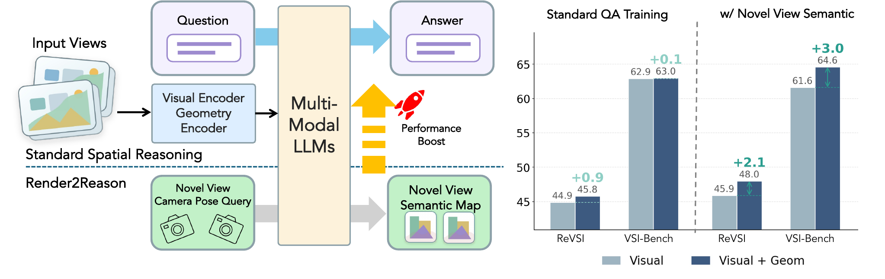

<br />
<p align="center">
  <h1 align="center">Render to Reason: Novel-View Semantic Prediction Improves Spatial Understanding in VLMs</h1>
  <p align="center">
    <a href="http://yuqunw.github.io"><strong>Yuqun Wu</strong></a><sup>1</sup>
    ·
    <a href="https://avaxiao.github.io/"><strong>Yao Xiao<sup>1</sup>
    ·
    <a href="https://zouchuhang.github.io"><strong>Chuhang Zou</strong></a><sup>2</sup>
    ·
    <a href="https://shenlong.web.illinois.edu"><strong>Shenlong Wang</strong></a><sup>1</sup>
    ·
    <a href="http://dhoiem.cs.illinois.edu"><strong>Derek Hoiem</strong></a><sup>1</sup>
  </p>
  <p align="center">
    <sup>1</sup>University of Illinois at Urbana-Champaign &nbsp;&nbsp; <sup>2</sup>Meta
  </p>
</p>
  <p align="center">
    <a href='https://yuqunw.github.io/Render2Reason/' style='padding-left: 0.5rem;'>
      </a>
    <a href='https://arxiv.org/abs/2610.05417'></a>
    <a href='https://huggingface.co/yuqun/R2R-Qwen3-VL-8B' style='padding-left: 0.5rem;'>
      </a>
    <a href='https://huggingface.co/datasets/yuqun/3D-Point-QA' style='padding-left: 0.5rem;'>
      </a>
  </p>
</p>
<p align="center">

</p>
<br />

This repository contains the code for the paper [Render to Reason: Novel-View Semantic Prediction Improves Spatial Understanding in VLMs](https://yuqunw.github.io/Render2Reason/).
Adding geometry features from a pretrained 3D model (VGGT) to a VLM and training on standard spatial QA brings only marginal gains, because most questions can be answered from visual features and language priors alone. We propose **novel-view semantic rendering** as an auxiliary training task: given the input views and the camera token of an unseen view, the model predicts the semantic layout of that view. Solving it requires both pathways (geometry for pose-dependent visibility, vision for semantic content), and it improves spatial reasoning on VSI-Bench, ReVSI and our 3D-Point-QA benchmark.


## Updates

[Oct 2026] Inference and evaluation code and model checkpoints are released. Training code and data-preparation scripts are coming soon.

---

## Getting Started

### Installation

1. Clone this repository:
  ```bash
    git clone https://github.com/yuqunw/R2R.git
    cd R2R
  ```
2. Create a conda environment and install the dependencies:
  ```bash
    conda create -n r2r python=3.12 -y
    conda activate r2r
    pip install torch torchvision --index-url https://download.pytorch.org/whl/cu130 # Install the pytorch fitting your CUDA version (we use torch 2.11.0 + CUDA 13.0)
    pip install -r requirements.txt
    pip install flash-attn==2.8.2 --no-build-isolation
    pip install -e qwen-vl-utils
  ```
3. Set up VGGT:
  ```bash
    bash tools/setup_vggt.sh   # clones VGGT into third_party/vggt and applies a small dtype patch
  ```
  The VGGT weights (`facebook/VGGT-1B`) are downloaded from Hugging Face on first use.

### Download Checkpoints

| Model            | Base model                                                               | Checkpoint                                                                   |
| ---------------- | ------------------------------------------------------------------------ | ---------------------------------------------------------------------------- |
| R2R-Qwen3-VL-8B  | [Qwen3-VL-8B-Instruct](https://huggingface.co/Qwen/Qwen3-VL-8B-Instruct) | [`yuqun/R2R-Qwen3-VL-8B`](https://huggingface.co/yuqun/R2R-Qwen3-VL-8B) |
| R2R-Qwen3-VL-4B  | [Qwen3-VL-4B-Instruct](https://huggingface.co/Qwen/Qwen3-VL-4B-Instruct) | [`yuqun/R2R-Qwen3-VL-4B`](https://huggingface.co/yuqun/R2R-Qwen3-VL-4B) |

```bash
cd qwen-vl-finetune
hf download yuqun/R2R-Qwen3-VL-8B --local-dir checkpoints/R2R-Qwen3-VL-8B
```

All commands below are run from `qwen-vl-finetune/` and take a local checkpoint directory.

## Quick Demo

Ask a spatial question about any video:

```bash
python qwenvl/eval/demo.py \
    --checkpoint checkpoints/R2R-Qwen3-VL-8B \
    --video path/to/video.mp4 \
    --question "How many chairs are in this room? Please answer the question using a single word or phrase." \
    --num-frames 32
```

Arguments:

- `--video` or `--frames`: an input video, or a directory of frames (sorted by file name)
- `--num-frames`: number of frames sampled uniformly from the input (default: 32)
- `--fps`: frame rate of the `--frames` directory, used for the per-frame timestamps given to the model (default: 1.0)
- `--max-new-tokens`: maximum answer length (default: 128)

The answer is printed to the terminal. VGGT features are computed on the fly.

## Evaluation

We evaluate on [VSI-Bench](https://huggingface.co/datasets/nyu-visionx/VSI-Bench), [ReVSI](https://huggingface.co/datasets/3dlg-hcvc/ReVSI) and our 3D-Point-QA benchmark.

### Download Evaluation Data

VSI-Bench and ReVSI are read directly from their official videos, and 3D-Point-QA is hosted on [🤗 Hugging Face](https://huggingface.co/datasets/yuqun/3D-Point-QA):

```bash
cd qwen-vl-finetune/data

# VSI-Bench
hf download nyu-visionx/VSI-Bench --repo-type dataset --local-dir VSI-Bench --include "*.zip" "test.jsonl"
cd VSI-Bench && for f in arkitscenes scannet scannetpp; do unzip -q $f.zip; done && cd ..

# ReVSI (questions are loaded from the Hugging Face dataset at evaluation time)
hf download 3dlg-hcvc/ReVSI --repo-type dataset --local-dir ReVSI --include "video.zip"
cd ReVSI && unzip -q video.zip -d videos && cd ..

# 3D-Point-QA (validation split)
hf download yuqun/3D-Point-QA --repo-type dataset --local-dir 3d_point_qa --include "val*"
cd 3d_point_qa && tar -xf val_images.tar && cd ../..
```

The data should be organized as follows:

```
qwen-vl-finetune/data/
├── VSI-Bench/
│   ├── test.jsonl                  # VSI-Bench questions (5,130)
│   ├── arkitscenes/<scene>.mp4
│   ├── scannet/<scene>.mp4
│   └── scannetpp/<scene>.mp4
├── ReVSI/videos/
│   ├── 16_frame/<scene>.mp4        # official 16-, 32- and 64-frame videos
│   ├── 32_frame/<scene>.mp4
│   └── 64_frame/<scene>.mp4
└── 3d_point_qa/
    ├── val.jsonl                   # 3D-Point-QA questions (5,250)
    └── images/<scene>/frame_XXXXXX.jpg
```

### VSI-Bench and ReVSI

```bash
bash scripts/eval_vsibench.sh
bash scripts/eval_revsi.sh
```

The settings are at the top of each script:

- `CKPT` and `BASE_MODEL`: the local checkpoint and its base model
- `NUM_FRAMES`: number of input frames. For VSI-Bench, frames are sampled uniformly from the full video. For ReVSI, the official video with this many frames is used, so it must be 16, 32 or 64. The paper uses 128 (VSI-Bench) and 64 (ReVSI) for the 8B model, and 16 for the 4B model.
- `GPUS`: GPU ids; questions are split across them by scene
- `OUTPUT_DIR`: where results are written (default: `eval_results/<checkpoint name>`)

Each run writes `metrics_<benchmark>_<frames>f.json` and `.xlsx` with per-category and average scores (accuracy for multiple-choice questions, mean relative accuracy for numerical ones), plus the raw predictions in `predictions_<benchmark>_<frames>f_shard*.jsonl`.

### 3D-Point-QA

[3D-Point-QA](https://huggingface.co/datasets/yuqun/3D-Point-QA) tests low-level geometric reasoning on ScanNet++, with points marked by colored arrows (drawn at load time). The validation split has five tasks: point-to-camera distance, point-to-point distance, relative distance comparison, point matching across views, and 3D coordinate mapping. The training split will be used by the upcoming training code.

```bash
bash scripts/eval_3d_point_qa.sh
```

`CKPT`, `BASE_MODEL`, `GPUS` and `OUTPUT_DIR` are set at the top of the script as above. Results are written to `eval_results/<checkpoint name>/3d_point_qa/metrics_lowlevelqa.json` and `low_level_qa_summary.xlsx`, with these per-task metrics:

| Task | Metric |
| --- | --- |
| point-to-camera distance (`distance_to_camera`) | δ<sub>1.25</sub> |
| point-to-point distance (`distance_prediction`) | δ<sub>1.25</sub> |
| relative distance comparison (`distance_infer`) | accuracy |
| point matching (`position_matching`) | PCK@0.05 |
| 3D coordinate mapping (`spatial_imagination_3d`) | % of points within 0.5 m |

## Training

Training code and data-preparation scripts are coming soon.

## Acknowledgement

We thank the great work from these repositories:
* [Qwen3-VL](https://github.com/QwenLM/Qwen3-VL) for the base model and fine-tuning code
* [VGGT](https://github.com/facebookresearch/vggt) for geometry features
* [InternImage](https://github.com/OpenGVLab/InternImage) for semantic pseudo-labels
* [VSI-Bench / VSI-590K](https://github.com/vision-x-nyu/thinking-in-space), [ReVSI](https://huggingface.co/datasets/3dlg-hcvc/ReVSI) and [VLM-3R](https://github.com/VITA-Group/VLM-3R) for spatial QA data and benchmarks
* [ScanNet](http://www.scan-net.org), [ScanNet++](https://kaldir.vc.in.tum.de/scannetpp) and [ARKitScenes](https://github.com/apple/ARKitScenes) for the 3D scene data

## Citation
If you find this method helpful for your research, please consider citing the following BibTeX entry.
```BibTex
@article{wu2026render,
  title   = {Render to Reason: Novel-View Semantic Prediction Improves Spatial Understanding in VLMs},
  author  = {Wu, Yuqun and Xiao, Yao and Zou, Chuhang and Wang, Shenlong and Hoiem, Derek},
  journal = {arXiv preprint arXiv:2610.05417},
  year    = {2026}
}
```

## License

This code is released under the Apache 2.0 License. See [LICENSE](LICENSE) for details. Model weights and data follow the licenses of their respective sources.
